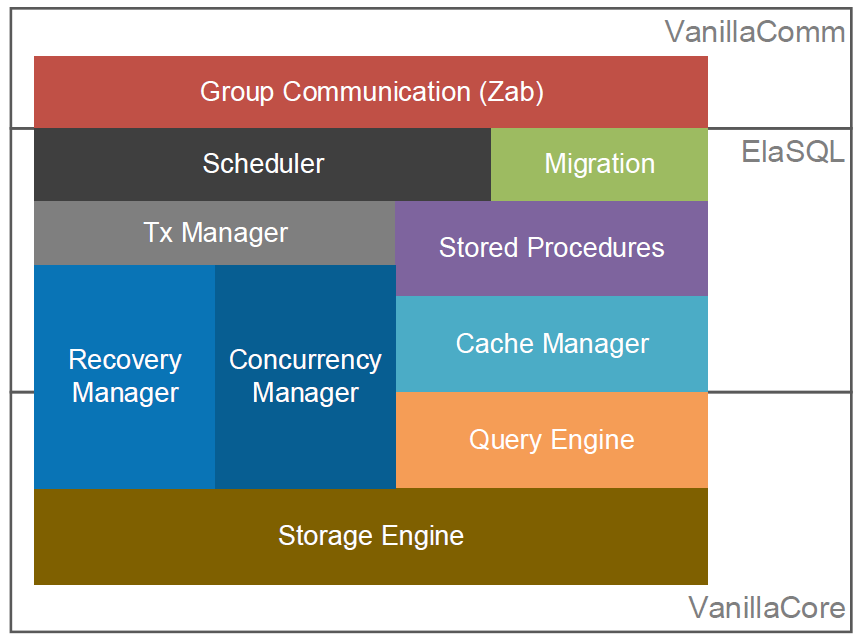
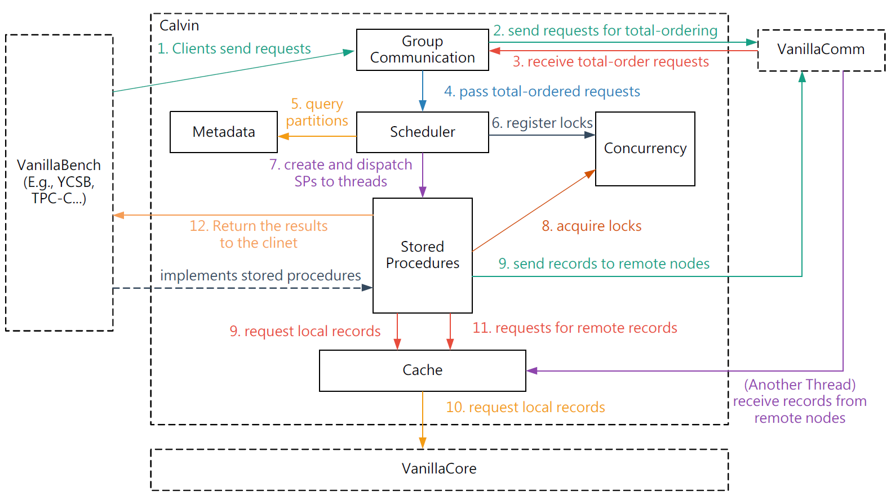

# ElaSQL Architecture

This document summaries the architecture of ElaSQL.

The following figure show the modules inside ElaSQL.

Here we explain the functionality of each module:

- Group Communication
  - Responsible for communication with other servers and clients.
  - Two types of communication protocols are supported:
    - Zookeeper Atomic Broadcast (ZAB): for ordering client requests
    - Point-to-Point (P2P): for sending messages between any pair of nodes
  - Backed by [VanillaComm](https://github.com/vanilladb/vanillacomm)
- Scheduler
  - Responsible for receiving total ordered requests, analyzing the requests and scheduling the requests to worker threads.
  - Single-threaded
- Migration
  - Responsible for issuing a data migration task and managing the progress of data migrations.
  - This module is turned off by default and can be turned on in `elasql.properties`.
- Stored Procedures
  - Responsible for executing transaction logic.
- Cache Manager
  - Responsible for managing a cache for temporarily saving records coming from remote machines and between transactions. 
- Query Engine & Storage Engine
  - Responsible for answering SQLs and storing data on disks.
  - Here we reuse the query engine and storage engine of [VanillaCore](https://github.com/vanilladb/vanillacore), and we create a class, `org.elasql.cache.VanillaCoreCrud`, as the CRUD interface to interact with VanillaCore. All the data queries and manipulations will go through this interface.
- Transaction (TX)
  - Concurrency Manger
    - Responsible for ensuring transactional consistency and isolation via locking mechanism.
    - Since ElaSQL is a deterministic DBMS, we implement Conservative Ordered Locking Protocol to ensure determinism.
  - Recovery Manager
    - Responsible for logging client requests.
    - VanillaCore already has a recovery mechanism to ensure durability. This recovery manager only logs transaction requests to ensure determinism.

## Transaction Workflow (Calvin)

In order to better understand the codebase, we suggest you to follow the workflow of a transaction.

The following figure shows the workflow of a transaction in the Calvin implementation of ElaSQL.

