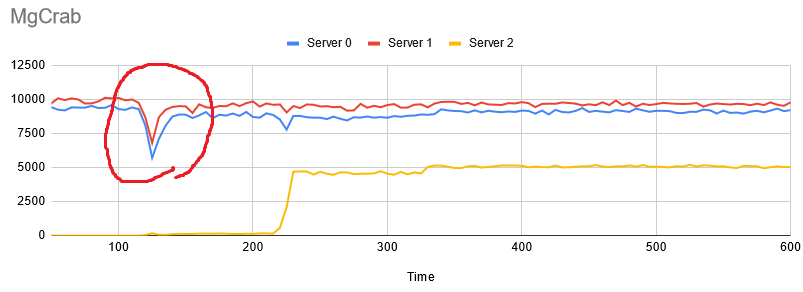

# Reproducing MgCrab Experiments

This document guides the people who want to reproduce the experiments on [the MgCrab paper](https://dl.acm.org/doi/10.14778/3303753.3303764) using ElaSQL.

## Step 1: Preparing the Development Environment and Cloning the Projects

Please check our [Getting Started Guide](getting_started.pdf) to have a basic knowledge about [ElaSQL](https://github.com/elasql/elasql) and [ElaSQL-Bench](https://github.com/elasql/elasqlbench) and how to setup a development environment for the projects.

Note that, in order to reproduce MgCrab experiments, it would be better to checkout `reproduce/mgcrab` branch in ElaSQL and ElaSQL-Bench.

## Step 2: Setting up Testing Environment

Once you have read [Getting Started Guide](getting_started.pdf), you should have known how to run experiments with ElaSQL-Bench.

However, due to the complexity of running large-scale experiments on a cluster, we suggest users to use our auto deployment and large-scale benchmarking tool, [Auto-Bencher](https://github.com/SLMT/auto-bencher), to reproduce experiments. Please check out [the README](https://github.com/SLMT/auto-bencher) to know how to use the tool to set up a testing environment.

### JVM Settings

In our experiments, we found that a small heap may cause frequent garbage collections. The recommended setting of the heap size for each database server is at least 5GB. That is, we recommend to add a VM argument `-XmxC` with `C` no less than 5GB. 

## Step 3: Getting Our Parameters

We provide the parameters that we set for the MgCrab experiments in [this parameter folder](https://github.com/SLMT/auto-bencher/tree/master/parameters/mgcrab) in Auto Bencher repository. Each sub-folder in it represents an experiment set:

- `scale-out`: the TPC-C scale-out experiments with 3 database servers (Section 5.2 and 5.4 in the paper).
- `large-scale`: the large-scale TPC-C experiments with 12 and 18 database servers (Section 5.5 in the paper).
  - `3s-3d-6o`: 3 source nodes, 3 destination nodes and 6 other nodes
  - `3s-6d-9o`: 3 source nodes, 6 destination nodes and 9 other nodes

In each sub-folder, each file represents a set of parameters for loading or benchmarking with a certain migration algorithm:

- `load*.toml`: for loading a testbed for the experiment set
- `bench*-stop-copy.toml`: for benchmarking with Stop-and-Copy
- `bench*-albatross.toml`: for benchmarking with Albatross
- `bench*-squall.toml`: for benchmarking with Squall
- `bench*-mgcrab.toml`: for benchmarking with MgCrab

These files can directly be used as inputs to Auto-Bencher with `cargo run load` and `cargo run bench` commands.

### Note for YCSB Experiments

The code for running YCSB scale-out and consolidation (Section 5.2 and 5.3 in the paper) is not ready yet. We will release the code and corresponding parameters soon.

### Note for not Using Auto-Bencher

If you are not going to use Auto-Bencher, there are something that you may have to take care of:

- The parameter files above do not include the following settings since they will be generated by Auto-Bencher:
  - The IP address for servers and clients in `vanillacomm.properties`
  - The number of data partition `NUM_PARTITIONS` in `elasql.properties`
- The parameters in the first section `[auto_bencher]` are the configurations for Auto-Bencher. If you are not using Auto-Bencher, you can simply ignore them.
- Each section `[XXX]` represents the configurations in `XXX.properties`.

## Step 4: Run the Experiments

Now, everything for an experiments is now in place. You can reproduce any experiment you want.

### Note for Collecting Each Node Throughput

ElaSQL-Bench will generate a report that summaries the throughput and latency during a test for each client. In addition, Auto-Bencher will collect and merge these reports on multiple client machines into a single report. Usually, this report is enough for researchers.

However, in the MgCrab paper, we also want to see the throughput of each individual server node, but the report does not distinguish the throughput of each node. In order to get the timeline of throughput for each node, you need to manually collect `client-*.log` on each client machine. Once you collect the logs, you can execute [this script](../scripts/mgcrab-parse-timeline.py), which generates two CSV files that summary the throughput and average latency for each server node.

### Note for the Drop at the Beginning of a Data Migration

If you run a TPC-C scale-out experiment, the system may experience a drop at the beginning of a data migration:

In our investigation, this is due to JVM's Just-In-Time (JIT) compilation. We have tested a few ways to eliminate drops, but those approaches also impact overall performance. So, we decide to leave it alone for now.

The reason that we did not see this drop in the experiments of the MgCrab paper is that the latest codebase of ElaSQL has evolved a lot since the paper was written. The overall performance and CPU utilization have been improved 20~25% since then. This drop may have appeared in the previous experiments, but it might not be obvious because CPUs were not fully utilized.

## Other Information

### Hardware Information

We used a cluster with 30 machines. Each machine has the following or a similar set of environment:

- CPU: Intel Core i5-4460 3.2 GHz
- RAM: DDR2 32GB
- Disk: 128GB SSD
- OS: CentOS 7 64-bit
- Network Bandwidth: 1 Gbps
- JDK: Java SE 8u211

### Tracing the Code

First, we suggest you to check [this document](elasql-architecture.md) for an overview of the architecture of ElaSQL. Next, please follow the workflow shown in the document to understand how a transaction request is processed in the system.

After you have a basic knowledge about the system, you can then start to trace the code in `org.elasql.migration`, which includes all the migration algorithms shown in the MgCrab paper. We suggest you to start form the following classes:

- `org.elasql.migration.MigrationSystemController`
  - The central controller that issues a data migration plan to all machines.
  - Only the sequencer server has this controller.
  - MgCrab extends this class because it has to trigger additional phases.
- `org.elasql.migration.MigrationMgr`
  - The manager that records migration progress and states on each server node.
  - Each server node has its own MigrationMgr.
  - Each migration algorithm implements its own MigrationMgr.
